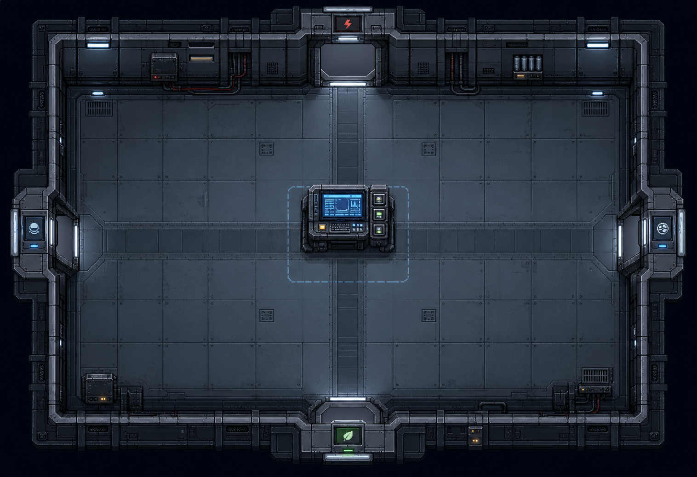

# TR-002 训练中控室 (Training Control Hub) — Art Asset Generation Brief

Status: Reference mood image approved (below). Individual sliced game assets
not yet generated — see `asset_prompts.md` in this same folder for the 8
per-piece generation prompts (floor tile / 2 door-frame orientations /
console / 4 door signage icons) needed before code integration.

Reference:

This is a developer-written instruction set for generating the target art for
the training base's hub room (`训练中控室`, `scripts/training/training_base_map.gd`
`_hub_area_config()`). It follows the same two conventions already established
in this repo:

- **`docs/art/TR-001`** — the approved "Target Screenshot" mockup for 训练模块一
  (宇航服基础控制/suit control room). TR-002 must read as the *same room family*
  as TR-001 — same palette, same tile floor, same top-down chibi player, same
  lighting mood — since players walk between this hub and that room directly.
- **`docs/art/ASSET_OLD_BASE_ART_SLICE.md`** — the layered, modular replacement
  approach already used for the old base core room (separate floor/wall/prop/
  lighting/player layers + reusable prop scenes, not one baked background).
  TR-002 should follow the same integration shape so the hub can receive real
  art without touching `_hub_area_config()`'s gameplay data.

## Why this room needs it

The hub currently renders as a pure code-drawn placeholder
(`TrainingRoomBlockout._draw()` in `scripts/training/training_module_scene.gd`):
flat rects, grid lines, and two decorative panel rects — no real floor
texture, no distinct doors, no console art, and the player is a plain
line-drawn astronaut icon (`TraineeVisual`). Every other "target screenshot"
room in `docs/art/` has already moved past this stage; the hub has not.

## Scene facts (ground truth — do not deviate from these positions)

Design canvas: **760×520 px**, strict top-down 2D, no perspective/isometric tilt.

| Element | Label | Position (top-left) | Size | Notes |
|---|---|---|---|---|
| Central console | 训练状态终端 | (330, 210) | 100×80 | `kind: terminal`, info-only, no door |
| Door — top wall | 配电房 | (326, 18) | 108×96 | leads to Power Distribution Room |
| Door — left wall | 宇航服整备室 | (30, 210) | 64×140 | leads to Suit Prep Room (always unlocked) |
| Door — right wall | 空气系统控制室 | (666, 210) | 64×140 | leads to Air System Control Room |
| Door — bottom wall | 训练温室 | (330, 446) | 100×54 | leads to Greenhouse Room |
| Player spawn | — | (350, 330) | 42×54 (player sprite) | near-center, slightly below the console |

All four doors sit flush against the room's outer wall on their respective
side (top/left/right/bottom) — the room is a simple cross/plus layout with
the console in the middle, matching TR-001's own room shape.

## Composition

- Top-down view, camera directly overhead, matching TR-001 exactly (no angle
  change between rooms the player walks through back-to-back).
- Walls form a single rectangular room with exactly 4 openings (one per
  side, at the positions above) — not a maze, not multiple rooms.
- Central console sits slightly above room-center, facing "down" toward
  where the player naturally stands.
- Each of the 4 doors should be readable at a glance as leading somewhere
  *different* — see "Do Not Drift" below.

## Color Palette (reuse TR-001's approved 7-swatch set exactly)

| Swatch | Use |
|---|---|
| 深空背景 (deep space near-black, `#07111b`/`#0e181f` family) | outside-room void |
| 地面结构 (cool slate gray-blue, `#17222c`/`#18232e` family) | floor tile base |
| 科技蓝 (tech blue, `#4f8eb8`/`#67b7e8`/`#87d9ff` family) | console screens, wall light strips |
| 交互黄 (interaction yellow, `#f0c766` family) | "E 交互" prompts, active/highlighted state only |
| 生命绿 | greenhouse-adjacent signage only (near the 训练温室 door) |
| 警告红 | power/electrical signage only (near the 配电房 door) |
| 灯光白/灯光暖 | overhead light fixtures |

Do not introduce new hues outside this set. This room sits between the main
menu's cool deep-space palette and the AUI application system's dark-navy
panels — all three must read as one visual world.

## Lighting

- Same reference as TR-001: cool overhead strip lighting (科技蓝/白) as the
  primary source, small localized warm highlights only at the console screen
  and door status lights — not a general warm wash.
- No colored ambient fill beyond what the light fixtures themselves cast.

## Required reusable objects (art-slice layers, not a baked background)

Following the old-base-art-slice folder shape, place new assets at:

- `assets/art/training_hub/tiles/` — floor tile(s), matching TR-001's floor
  tile set (reuse those tiles directly if visually identical; only add new
  tiles if the hub's floor pattern needs to differ, e.g. a "hub" logo/marking
  underfoot near the console).
- `assets/art/training_hub/props/` —
  - `hub_console.png` (or a small prop scene) for 训练状态终端
  - `door_frame_horizontal.png` (top/bottom orientation, reused for 配电房
    and 训练温室's door openings)
  - `door_frame_vertical.png` (left/right orientation, reused for 宇航服整备室
    and 空气系统控制室's door openings)
  - one small signage/placard sprite per door (see below) — these carry the
    "which room is this" readability, not the door frame itself
- `assets/art/training_hub/lighting/` — overhead light fixture sprite(s),
  reusing TR-001's lighting reference if the fixture design already exists there
- `assets/art/player/` — **do not duplicate**; the hub reuses the same player
  sprite already established for TR-001 (training rooms share one player look)

Interactive objects (console, each door) must remain separate nodes/sprites,
never baked into the floor/wall background image — this matches
`ASSET_OLD_BASE_ART_SLICE.md`'s existing rule and keeps `TrainingTargetVisual`'s
highlight-ring/highlighted-state overlay working without rework.

## Do Not Drift

- Do not make all 4 doors visually identical. Each leads to a differently
  themed room and should hint at that from the hub side, via a small placard/
  color accent above the door frame, not a redesigned door shape:
  - 配电房 door: warning-red accent placard (electrical hazard motif)
  - 训练温室 door: life-green accent placard (small leaf/plant icon)
  - 宇航服整备室 / 空气系统控制室 doors: neutral tech-blue placards
- Do not bake the console or doors into a single flat background image —
  breaks the existing highlight/interaction-prompt system.
- Do not add neon/cyberpunk saturation, horror elements, or fantasy motifs —
  same constraint already stated in OB-001, applies equally here.
- Do not change the 760×520 canvas proportions or the 4 door positions above
  — `_hub_area_config()`'s target positions are gameplay-load-bearing and
  must still line up with wherever the real door art ends up.

## Acceptance target

The hub should stop reading as a placeholder rectangle-and-grid blockout and
instead read as the *same real training facility* TR-001 already established
— a room a trainee would actually walk through between modules, with a
readable central console and four distinguishable doorways — without any
change to `_hub_area_config()`'s data or `TrainingTargetVisual`'s interaction
logic.
